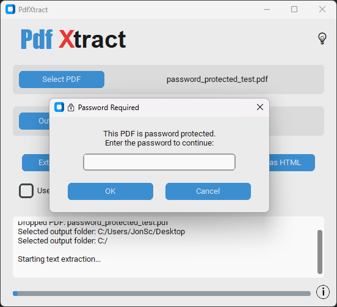
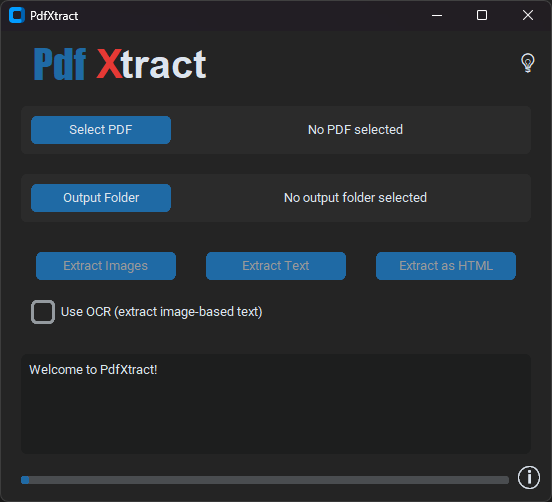

# PdfXtract - A PDF Asset Extraction Utility

PdfXtract is a modern desktop application for extracting various assets from PDF documents. Built with CustomTkinter, it provides a user-friendly, theme-aware experience for both Windows and macOS.

## Key Features

-   **Image Extraction**: Extracts all embedded images from a PDF and saves them as individual files (e.g., PNG, JPG).
-   **Text Extraction**: Collates all text content from the PDF into a single, UTF-8 encoded `.txt` file.
-   **OCR Support**: Can perform Optical Character Recognition (OCR) to extract text from scanned documents or images within the PDF.
-   **HTML Conversion**: Converts the entire PDF document into a single `.html` file, preserving a basic layout structure.
-   **Intuitive UI**: Simple controls, real-time feedback, and a clean, modern interface.
-   **Drag & Drop**: Supports dragging and dropping a PDF file directly onto the application window.
-   **Password Handling**: Automatically prompts for a password if the selected PDF is encrypted.
-   **Light & Dark Modes**: Includes a theme toggle for user preference.

## Requirements

To run this script from the source, you need Python and the following libraries. You can install them using pip:

```bash
pip install customtkinter PyMuPDF Pillow tkinterdnd2 easyocr
```

## How to Use

1.  Run the `pdfxtract.pyw` script.
2.  Click **"Select PDF"** to choose your file (or drag and drop it onto the window).
3.  Click **"Output Folder"** to choose where to save the extracted assets.
4.  Click one of the **"Extract..."** buttons to begin the process.

## Screenshots

The application supports both light and dark modes for user comfort.

| Light Mode                                       | Dark Mode                                      |
| ------------------------------------------------ | ---------------------------------------------- |
|  |  |

## License

This project is licensed under the GNU General Public License v3.0 (GPLv3).

---

*Copyright © 2024 Jonathan Schoenberger*